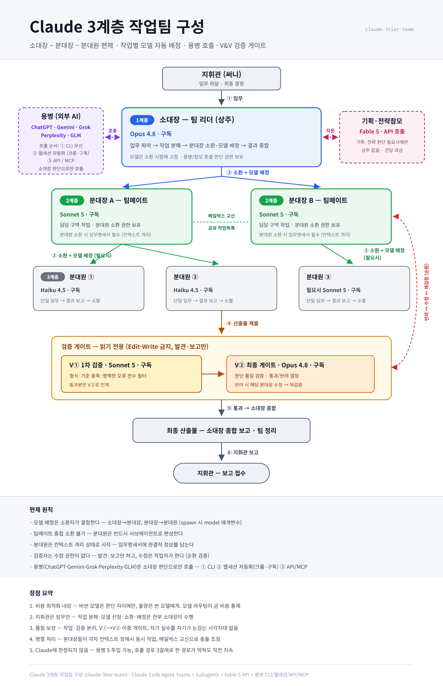

# Claude 3계층 작업팀 구성법 (claude-3tier-team)

Claude Code Agent Teams 위에 **소대장–분대장–분대원 3계층 군대식 편제**를 구성하는 스킬입니다. 임무를 내리면 소대장이 작업을 분해하고, 계층별로 적합한 모델을 배정해 병렬 수행하며, 이중 검증 게이트를 통과한 산출물만 보고합니다.



## 편제

| 계층 | 직책 | 실체 | 모델 |
|---|---|---|---|
| — | 지휘관 | 사용자 | — |
| 1계층 | 소대장 (팀 리더, 상주) | 현재 세션 | Opus 4.8 |
| 2계층 | 분대장 (팀메이트) | Agent Teams | Sonnet 5 |
| 3계층 | 분대원 (서브에이전트) | Subagent | Haiku 4.5 (필요시 Sonnet 5) |
| 특수 | 검증담당 V① / V② (읽기 전용) | 팀메이트 | Sonnet 5 / Opus 4.8 |
| 특수 | 기획·전략참모 (비상주, API) | 스크립트 호출 | Fable 5 |
| 특수 | 용병 (외부 AI 5종) | ChatGPT·Gemini·Grok·Perplexity·GLM | CLI → 웹세션 → API 폴백 |

핵심 원칙: **모델 배정은 소환자가 결정한다** (소대장→분대장, 분대장→분대원). 검증자는 수정 권한이 없고(발견·보고만), V① 전수 검증 → V② 최종 게이트를 통과해야 지휘관에게 보고됩니다. 비싼 모델은 판단 자리에만, 물량은 싼 모델에게 — 모델 라우팅이 곧 비용 통제입니다.

## 설치

```
📁 ~/.claude/skills/claude-3tier-team/
📄 SKILL.md            ← SKILL.md 복사
📁 scripts/            ← scripts/call-fable5.py 복사

📁 ~/.claude/agents/
📄 claude-3tier-squad-leader.md   ← agents/ 3개 파일 복사
📄 claude-3tier-verifier-v1.md
📄 claude-3tier-verifier-v2.md
```

요구 사항:
- Claude Code v2.1.178+ (권장 v2.1.201+)
- Agent Teams 활성화: settings.json에 `{ "env": { "CLAUDE_CODE_EXPERIMENTAL_AGENT_TEAMS": "1" } }`
- 전략참모(선택): 환경변수 `ANTHROPIC_API_KEY` (API 건당 과금)

## 사용

새 세션에서:

```
3계층 작업팀으로 ○○○ 해줘
```

소대장(세션)이 업무를 파악해 분대장들을 팀메이트로 소환하고, 검증 게이트까지 자동으로 운용합니다.

## 저장소 구성

```
📄 SKILL.md              — 스킬 본체 (편제·원칙·모델 라우팅·운용 절차·용병 매핑)
📁 agents/               — 분대장·검증담당 역할 파일 (model·tools frontmatter)
📁 scripts/              — call-fable5.py (Fable 5 전략참모 API 호출)
📁 assets/               — 구조도 SVG/PNG
```

## 라이선스

MIT
